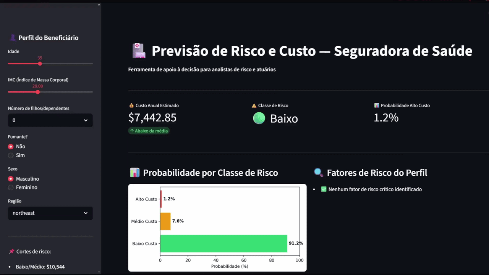

# 🧠 Previsão de Custo Médico e Risco de Paciente — Machine Learning

Projeto de **Data Science aplicado à saúde **, cujo objetivo é prever **gastos médicos anuais** e **risco de pacientes de alto custo** usando Machine Learning.

O projeto inclui **pipeline completo de dados + modelos + app interativo** para simular perfis de beneficiários.

📄 Versão extendida da documentação do projeto: [README.md](README.md)

---

# 🎥 Demonstração do App



O aplicativo permite inserir o perfil de um beneficiário e obter:

- 💰 **Custo médico anual estimado**
- 🚦 **Classe de risco (Baixo / Médio / Alto)**
- 📊 **Probabilidade de cada classe**
- 🧠 **Explicação dos fatores que influenciaram a decisão do modelo**

---

# 🎯 Objetivo do Projeto

Operadoras de saúde frequentemente enfrentam dificuldade para prever **quais beneficiários se tornarão pacientes de alto custo**.

Esse projeto utiliza **Machine Learning para antecipar esse risco**, permitindo:

- melhor **provisionamento financeiro**
- **precificação mais precisa** de planos
- **programas de prevenção direcionados**

---

# ❓ Perguntas Fundamentais que o Projeto Responde

### 1️⃣ Quanto essa pessoa provavelmente vai gastar por ano em saúde?

Resolvido com **modelo de regressão XGBoost** treinado em 99.989 beneficiários.

**Resultado:**

- MAE: **$3.514**
- R²: **88.3%**

Ou seja, o modelo explica **88% da variação dos gastos médicos anuais**.

> 💡 Baseline com Regressão Linear atingiu R² de 86.3% — a diferença pequena confirma a qualidade da Feature Engineering, não limitação do XGBoost.

---

### 2️⃣ Essa pessoa tem chance de virar um paciente de alto custo?

Resolvido com **modelo de classificação Random Forest**.

Classes definidas por percentis do dataset:

| Classe | Corte | Custo Médio |
|---|---|---|
| 🟢 Baixo | até $10.543 | $8.002 |
| 🟡 Médio | $10.543 – $17.530 | $13.596 |
| 🔴 Alto | acima de $17.530 | $34.757 |

Resultado:

- **Acurácia:** 72%
- **Precision para alto custo:** 94%

🚨 **Resultado crítico:**

```
Falsos negativos críticos (Alto → Baixo): 0
```

Ou seja:

**nenhum paciente de alto custo foi classificado como baixo risco**, que é o erro mais perigoso para seguradoras.

---

### 3️⃣ Quais fatores mais influenciam o custo médico?

Utilizando **Explainability com SHAP**.

Principais fatores identificados:

| Ranking | Feature | SHAP médio |
|---|---|---|
| 🥇 1º | Tabagismo | 0.368 |
| 🥈 2º | Idade | 0.230 |
| 🥉 3º | Obesidade | 0.070 |
| 4º | IMC | 0.046 |
| 5º | Interação fumante + obeso | 0.034 |

Insight principal:

> **Ser fumante é 1.6x mais determinante que a idade para o custo médico.**

---

### 4️⃣ Dado um perfil, ele tende a gerar custo baixo, médio ou alto?

O modelo classifica cada beneficiário em uma das 3 faixas de risco e retorna a **probabilidade de cada classe individualmente**, permitindo **estratégias diferentes de gestão de risco para cada grupo**.

---

# 📊 Insights Principais do Projeto

Alguns achados importantes da análise exploratória:

- **Fumantes gastam em média 3.5x mais** que não fumantes ($43.908 vs $12.678/ano)
- Apenas **11% dos beneficiários (alto custo) geraram $637 milhões em sinistros**
- **Fumantes obesos** (10.9% da base) têm custo médio de **$51.462/ano** — o perfil mais crítico
- O **IMC isolado tem correlação fraca (0.14)** com custo — mas combinado com tabagismo gera correlação de 0.74

Exemplo real do modelo:

| Perfil | Custo previsto | Classe | Prob. Alto Custo |
|---|---|---|---|
| Fumante obeso, 52 anos | $63.587 | 🔴 Alto | 99.7% |
| Jovem saudável, 22 anos | $4.274 | 🟢 Baixo | 0.6% |
| Adulto não fumante, 45 anos | $13.785 | 🟡 Médio | 24.3% |

Diferença anual de **$59.313 por paciente** entre o maior e o menor risco.

---

# ⚙️ Feature Engineering — Decisões Técnicas

As features mais importantes criadas no projeto:

- **`is_obese`** — binarização do IMC no corte clínico de 30
- **`smoker_obese`** — interação fumante × obeso (correlação 0.74 com charges)
- **`log(charges)`** — transformação logarítmica do target para reduzir assimetria de 1.87 → 0.63
- **Faixas etárias** — grupos usados em precificação de planos de saúde

---

# 🛠️ Tecnologias Utilizadas

- Python
- Pandas / NumPy
- Scikit-learn
- XGBoost
- SHAP
- Streamlit

---

# 📂 Estrutura do Projeto

```
data/           → dataset sintético (~100k linhas)
notebooks/      → EDA, Feature Engineering, Modelagem, Explainability
src/            → pipeline de dados
app.py          → app interativo Streamlit
docs/images/    → gráficos gerados nos notebooks
```

---

# 🚀 Executar o Projeto

```bash
git clone https://github.com/ghs-mk/projeto-insurtech
cd projeto-insurtech
pip install -r requirements.txt
streamlit run app.py
```

---

# 👤 Autor

**Gustavo Henrique da Silva**

**Linkedin:**

www.linkedin.com/in/gustavo-henrique-silva-a6b826268

Projeto de portfólio focado em **Data Science aplicada à saúde e análise de risco financeiro.**
