# 🏥 Previsão de Risco e Custo — Insurtech com Machine Learning

> Projeto completo de Data Science aplicado à saúde suplementar: previsão de gastos médicos anuais e classificação de risco de sinistralidade para beneficiários de planos de saúde.

📄 Versão resumida da documentação do projeto: [EXECUTIVE_SUMMARY.md](EXECUTIVE_SUMMARY.md)


---

## 📌 Índice

- [Visão Geral](#visão-geral)
- [Problema de Negócio](#problema-de-negócio)
- [Perguntas que o Projeto Responde](#perguntas-que-o-projeto-responde)
- [Dataset](#dataset)
- [Estrutura do Projeto](#estrutura-do-projeto)
- [Etapa 1 — Análise Exploratória (EDA)](#etapa-1--análise-exploratória-eda)
- [Etapa 2 — Feature Engineering](#etapa-2--feature-engineering)
- [Etapa 3 — Modelagem: Regressão](#etapa-3--modelagem-regressão)
- [Etapa 4 — Modelagem: Classificação](#etapa-4--modelagem-classificação)
- [Etapa 5 — Explainability com SHAP](#etapa-5--explainability-com-shap)
- [App Streamlit](#app-streamlit)
- [Resultados Finais](#resultados-finais)
- [Limitações e Próximos Passos](#limitações-e-próximos-passos)
- [Como Rodar o Projeto](#como-rodar-o-projeto)
- [Tecnologias](#tecnologias)

---

## 🎯 Visão Geral

Projeto híbrido que une **IA em Saúde + Risco Financeiro**, com foco em **prever o gasto médico anual e classificar o risco de sinistralidade de beneficiários de planos de saúde**.

O projeto demonstra capacidade técnica para **Healthtechs e Instituições Financeiras**, atuando como elo entre **dados clínicos e viabilidade econômica** — desde a exploração dos dados até um app interativo de apoio à decisão.

---

## ❓ Problema de Negócio

Operadoras de saúde como Amil, Bradesco Saúde e SulAmérica perdem milhões por não conseguirem antecipar quais beneficiários se tornarão **pacientes de alto custo (high cost members)**.

A falta de previsibilidade impacta diretamente:

- Precificação de planos
- Provisões financeiras (Loss Ratio / Sinistralidade)
- Estratégias de prevenção e saúde populacional
- Controle de caixa e resultado operacional

> 💡 **Um único paciente de alto custo pode custar até 15x mais do que um beneficiário típico.** Identificar esse perfil preventivamente é o coração da gestão de risco em saúde.

---

## ❓ Perguntas que o Projeto Responde

| # | Pergunta | Técnica usada |
|---|---|---|
| 1 | Quanto essa pessoa vai gastar por ano em saúde? | Regressão (XGBoost) |
| 2 | Ela tem chance de virar um paciente de alto custo? | Classificação (Random Forest) |
| 3 | Quais fatores mais influenciam esse custo? | SHAP Explainability |
| 4 | Qual categoria de risco ela representa para a seguradora? | Classificação 3 classes |

---

## 📂 Dataset

**Fonte base:** [Medical Cost Personal Dataset — Kaggle](https://www.kaggle.com/datasets/mirichoi0218/insurance)

**Dataset utilizado:** Versão sintética expandida com **99.989 linhas**, gerada para garantir volume estatístico adequado para Machine Learning, mantendo todas as relações e distribuições do dataset original.

### Variáveis

| Coluna | Tipo | Descrição |
|---|---|---|
| `age` | int | Idade do beneficiário (18–64 anos) |
| `sex` | string | Sexo: `male` / `female` |
| `bmi` | float | Índice de Massa Corporal |
| `children` | int | Número de filhos/dependentes (0–5) |
| `smoker` | string | Fumante: `yes` / `no` |
| `region` | string | Região: `northeast`, `northwest`, `southeast`, `southwest` |
| `charges` | float | 💰 **Gasto médico anual em USD — variável target** |

### Estatísticas do Dataset

| Métrica | Valor |
|---|---|
| Total de registros | 99.989 |
| Média de gastos | $18.944 |
| Mediana de gastos | $13.461 |
| Gasto mínimo | $2.024 |
| Gasto máximo | $65.000 |
| Desvio padrão | $15.332 |
| Assimetria (skewness) | 1.87 |
| % Fumantes | 20.1% |
| % Obesos (IMC > 30) | 54.4% |

---

## 📁 Estrutura do Projeto

```
projeto-insurtech/
├── data/
│   ├── raw/
│   │   └── insurance_100k_clean.csv       # Dataset sintético
│   └── processed/
│       ├── insurance_clean.csv            # Após limpeza
│       ├── insurance_features.csv         # Após feature engineering
│       ├── xgb_regressor.pkl              # Modelo de regressão salvo
│       ├── rf_classifier.pkl              # Modelo de classificação salvo
│       ├── risk_thresholds.json           # Cortes de risco
│       └── predicoes_regressao.csv        # Previsões do modelo
├── notebooks/
│   ├── 01_eda.ipynb                       # Análise exploratória
│   ├── 02_feature_engineering.ipynb       # Engenharia de features
│   ├── 03_model_regression.ipynb          # Modelagem regressão
│   ├── 04_model_classification.ipynb      # Modelagem classificação
│   └── 05_explainability.ipynb            # SHAP
├── src/
│   ├── preprocessing.py
│   ├── models.py
│   └── evaluation.py
├── docs/
│   └── images/                            # Gráficos gerados nos notebooks
├── app.py                                 # App Streamlit
├── requirements.txt
└── README.md
```

---

## Etapa 1 — Análise Exploratória (EDA)

> **Notebook:** `notebooks/01_eda.ipynb`

### Qualidade dos Dados

O dataset foi artificialmente criado seguindo uma pré analise da disposição dos dados mostrada no dataset público https://www.kaggle.com/datasets/mirichoi0218/insurance.

### Distribuição dos Gastos Médicos e a Decisão pelo Log

Um dos primeiros achados críticos foi a **forte assimetria à direita** na distribuição dos gastos médicos:

| Transformação | Skewness | Interpretação |
|---|---|---|
| `charges` original | **1.87** | Fortemente assimétrico — cauda longa à direita |
| `log(charges)` | **0.63** | Muito mais simétrico — adequado para regressão |

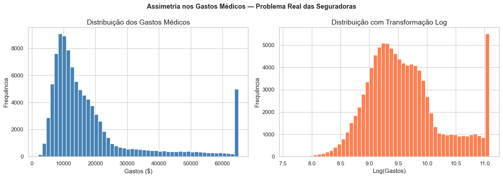

**Por que isso importa para o negócio?**

A assimetria de 1.87 significa que a maioria dos beneficiários gasta relativamente pouco, mas uma minoria gasta valores extremos. Esse é exatamente o problema das seguradoras: **poucos pacientes concentram a maior parte do custo.**

**Decisão técnica:** usar `log(charges)` como variável target na regressão para reduzir o impacto dos valores extremos e melhorar a performance do modelo.

---

### Fumantes vs Não Fumantes — O Insight Central

Este foi o gráfico mais impactante de todo o projeto:

```
Gasto médio não fumante:  $12.678/ano
Gasto médio fumante:      $43.908/ano
Razão:                    3.5x mais caro
```

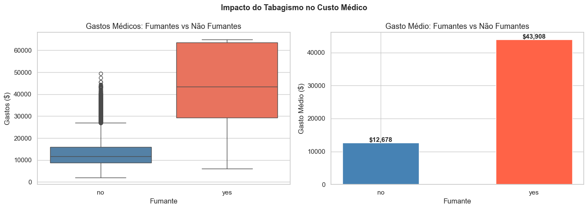

**Fumantes representam apenas 20.1% da carteira (20.063 pessoas), mas custam 3.5x mais do que não fumantes.**

> 💡 **Impacto financeiro real:** Em uma carteira de 100.000 beneficiários, uma seguradora que não identifica e provisiona corretamente para fumantes pode ter uma diferença de dezenas de milhões de dólares na sinistralidade anual.

O boxplot mostrou ainda que **o 3º quartil dos fumantes ($60.000+) supera o máximo da maioria dos não fumantes** — evidenciando que o tabagismo não apenas eleva o custo médio, mas cria uma cauda de pacientes extraordinariamente caros.

---

### Idade vs Gastos — Dois Grupos Distintos

O scatter plot de Idade × Gastos revelou uma estrutura visual importante: **dois clusters bem separados**, um para fumantes (acima) e outro para não fumantes (abaixo), ambos com tendência crescente conforme a idade.

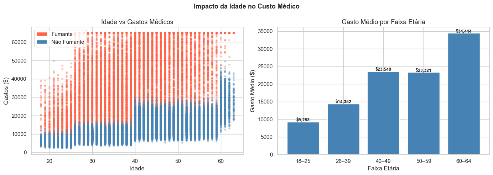

Isso significa que **a idade e o tabagismo têm efeitos independentes e cumulativos** sobre o custo médico.

| Fator | Correlação com charges |
|---|---|
| Fumante | 0.82 — Fortíssimo |
| Idade | 0.30 — Moderado |
| IMC | 0.14 — Fraco isolado |

---

### IMC vs Gastos — O Efeito da Obesidade

```
Gasto médio obesos (IMC > 30):     $21.324/ano
Gasto médio não obesos (IMC ≤ 30): $16.107/ano
Correlação IMC × charges:           0.136
```

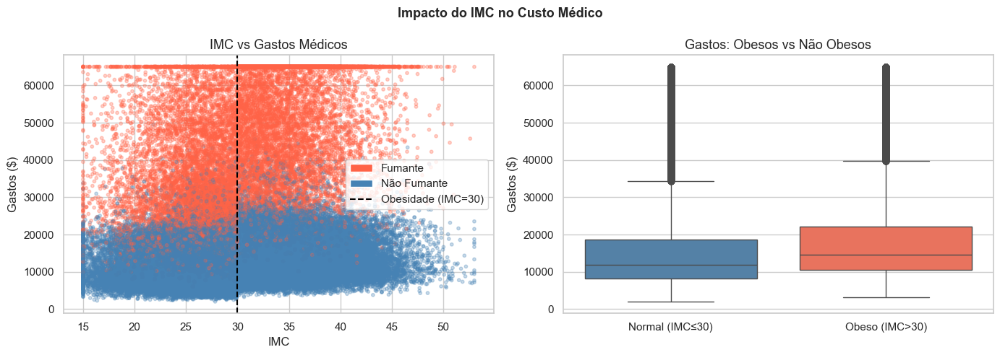

**Decisão técnica:** O IMC sozinho tem correlação fraca (0.14). Isso motivou a criação de uma **feature de interação** na etapa de Feature Engineering — combinando obesidade e tabagismo, que juntos produzem um efeito muito maior do que a soma dos dois isolados.

---

### Mapa de Correlações — Quais fatores mais impactam o custo?

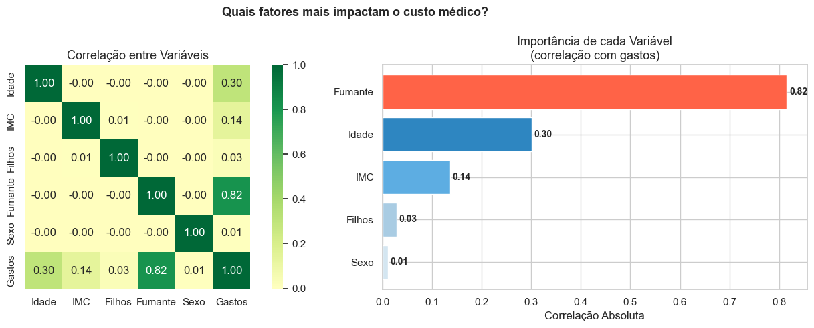

### Resumo dos Principais Insights do EDA

| Métrica | Valor |
|---|---|
| Total de beneficiários analisados | 99.989 |
| Fumantes na carteira | 20.063 (20.1%) |
| Custo médio fumante | $43.908/ano |
| Custo médio não fumante | $12.678/ano |
| Fumantes custam X vezes mais | **3.5x** |
| Obesos na carteira | 54.376 (54.4%) |
| Custo médio obesos | $21.324/ano |
| Fumantes obesos na carteira | 10.849 (10.9%) |
| Custo médio fumantes obesos | **$51.462/ano** |
| Pacientes de alto custo (>$40k) | 11.179 (11.2%) |
| Gasto total do grupo de alto custo | **$637.227.580** |

> 🔥 **11% dos beneficiários geraram $637 milhões em sinistros.** Identificar esse grupo preventivamente é o objetivo central do projeto.

---

## Etapa 2 — Feature Engineering

> **Notebook:** `notebooks/02_feature_engineering.ipynb`

### Features Criadas

#### 1. `is_obese` — Binarização do IMC
```python
is_obese = 1 se bmi > 30, caso contrário 0
```
**Hipótese:** O corte de IMC=30 é clinicamente estabelecido como limiar de obesidade e usado amplamente em planos de saúde para precificação e análise de risco.

#### 2. `smoker_obese` — Interação de Risco Máximo ⭐
```python
smoker_obese = 1 se (fumante E obeso), caso contrário 0
```
**Hipótese:** Fumantes obesos representam um perfil de risco significativamente maior do que a soma dos dois fatores isolados.

**Resultado da validação:**

| Feature | Correlação com charges |
|---|---|
| `is_obese` | 0.169 |
| `smoker_enc` | 0.816 |
| `smoker_obese` | **0.740** |

A feature de interação `smoker_obese` ficou com correlação de 0.74 — confirmando a hipótese e tornando-se uma das mais poderosas do modelo.

#### 3. Faixas Etárias — `age_group`
```python
Grupos: 0-18 | 19-25 | 26-39 | 40-49 | 50-59 | 60+
```
**Hipótese:** As faixas etárias utilizadas em precificação de planos de saúde capturam saltos não-lineares no custo de forma mais precisa do que a idade contínua sozinha.

#### 4. Encodings de Variáveis Categóricas
- `smoker_enc`: 1 = fumante, 0 = não fumante
- `sex_enc`: 1 = masculino, 0 = feminino
- `region_*`: one-hot encoding das 4 regiões

#### 5. `log_charges` — Transformação Logarítmica do Target
```python
log_charges = log(charges)
```
**Decisão:** Como visto no EDA, charges tem skewness de 1.87. A transformação log reduz para 0.63, tornando a distribuição mais simétrica e melhorando a performance da regressão.

### Validação das Features por Grupo de Risco

| Perfil | Custo Médio |
|---|---|
| Não fumante, não obeso | $11.322 |
| Não fumante, obeso | $13.812 |
| Fumante, não obeso | $35.014 |
| **Fumante, obeso** | **$51.462** |

A gradação perfeita entre os 4 grupos confirma que as features criadas capturam bem a estrutura de risco dos dados.

### Dataset Final

```
Shape original:                 (99.989, 7)
Shape após feature engineering: (99.989, 17)
Novas features criadas: is_obese, smoker_obese, smoker_enc, sex_enc,
                        region_*, age_*, log_charges
```

---

## Etapa 3 — Modelagem: Regressão

> **Notebook:** `notebooks/03_model_regression.ipynb`
>
> **Pergunta respondida:** *Quanto essa pessoa vai gastar por ano em saúde?*

### Estratégia de Modelagem

- **Target:** `log(charges)` — depois convertido de volta para $ com `exp()`
- **Split:** 80% treino (79.991 linhas) / 20% teste (19.998 linhas)
- **Seed:** 42 para reprodutibilidade

### Modelos Treinados

#### Baseline — Regressão Linear

A regressão linear serviu como referência para avaliar o ganho do modelo mais complexo.

#### Modelo Principal — XGBoost

```python
XGBRegressor(
    n_estimators=500,
    learning_rate=0.05,
    max_depth=6,
    subsample=0.8,
    colsample_bytree=0.8,
    random_state=42
)
```

### Resultados

| Modelo | MAE | R² | Interpretação |
|---|---|---|---|
| Regressão Linear (Baseline) | $3.585 | 86.3% | Excelente baseline |
| **XGBoost (Principal)** | **$3.514** | **88.3%** | **Melhor modelo** |

**XGBoost reduziu o erro em 2.0% vs Regressão Linear.**

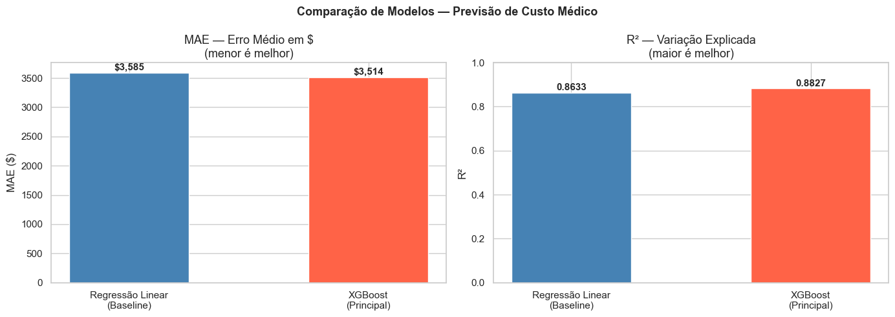

> 💡 **Por que a diferença foi pequena?** Nossas features foram tão bem construídas que até a regressão linear captou bem as relações. Isso é um sinal positivo da qualidade da Feature Engineering — não de limitação do XGBoost.

> 💡 **R² de 88.3%.** O modelo explica 88% da variação dos gastos médicos usando apenas 5 variáveis originais (idade, IMC, tabagismo, filhos e região).

### Análise de Resíduos

| Métrica | Valor | Interpretação |
|---|---|---|
| Resíduo médio | $495 | Modelo levemente otimista — normal e aceitável |
| Resíduo mediano | $257 | Muito próximo de zero — excelente |
| Subestimados > $5.000 | 8.4% | Casos de alto custo mais difíceis de prever |

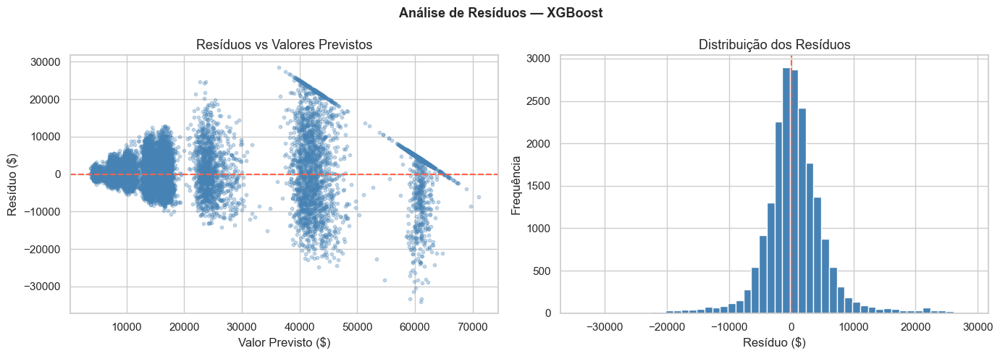

**Insight crítico:** Os 8.4% de casos subestimados em mais de $5.000 são exatamente os pacientes de alto custo que o modelo de regressão ainda tem dificuldade de capturar — e esse foi o argumento técnico para desenvolver também o modelo de classificação.

---

## Etapa 4 — Modelagem: Classificação

> **Notebook:** `notebooks/04_model_classification.ipynb`
>
> **Perguntas respondidas:** *Ela tem chance de virar um paciente de alto custo? Qual categoria de risco ela representa?*

### Definição das Classes de Risco

As classes foram definidas com base em percentis do dataset, garantindo distribuição balanceada:

| Classe | Corte | Custo Médio | % da Base |
|---|---|---|---|
| 🟢 Baixo | até $10.543 | $8.002 | 33.0% |
| 🟡 Médio | $10.543 – $17.530 | $13.596 | 33.0% |
| 🔴 Alto | acima de $17.530 | $34.757 | 34.0% |

**Decisão técnica:** Usar percentis (33/66) em vez de cortes arbitrários garante classes balanceadas e torna o modelo mais robusto.

### Modelo — Random Forest

```python
RandomForestClassifier(
    n_estimators=300,
    max_depth=10,
    min_samples_leaf=5,
    random_state=42
)
```

### Resultados

| Classe | Precision | Recall | F1-Score |
|---|---|---|---|
| 🟢 Baixo | 79% | 80% | 80% |
| 🟡 Médio | 55% | 75% | 64% |
| 🔴 Alto | 94% | 60% | 74% |
| **Acurácia geral** | | | **72%** |

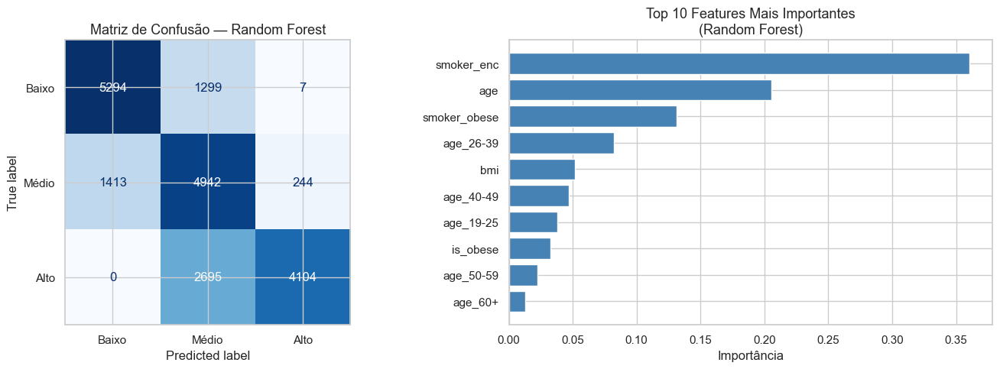

### O Resultado Mais Importante: Falsos Negativos Críticos = 0

> **Falsos negativos críticos** são pacientes de alto custo classificados erroneamente como baixo risco.
> Para uma seguradora, esse erro significa **provisionar menos do que o necessário** — risco financeiro direto.

```
Falsos negativos críticos (Alto → Baixo): 0
→ 0.0% dos pacientes de alto custo foram classificados como baixo risco
```

**O modelo nunca cometeu o erro mais custoso para a seguradora.** Isso é mais importante do que a acurácia geral de 72%.

### Interpretação por Classe

- **Baixo (79%/80%):** Ótima performance — identifica bem os pacientes de baixo custo
- **Médio (55%/75%):** Performance menor esperada — a classe do meio tem fronteiras naturalmente mais difusas
- **Alto (94%/60%):** Precision altíssima — quando o modelo diz "Alto", ele está certo 94% das vezes

---

## Etapa 5 — Explainability com SHAP

> **Notebook:** `notebooks/05_explainability.ipynb`
>
> **Pergunta respondida:** *Quais fatores mais influenciam o custo médico?*

SHAP (SHapley Additive exPlanations) permite entender **por que** o modelo tomou cada decisão.

### Importância Global das Features

| Ranking | Feature | SHAP médio | Interpretação |
|---|---|---|---|
| 🥇 1º | `smoker_enc` | 0.3679 | Tabagismo — fator dominante |
| 🥈 2º | `age` | 0.2298 | Idade — segundo mais importante |
| 🥉 3º | `is_obese` | 0.0699 | Obesidade — impacto relevante |
| 4º | `bmi` | 0.0456 | IMC contínuo — complementa obesidade |
| 5º | `age_26-39` | 0.0351 | Faixa etária adulta jovem |
| 6º | `smoker_obese` | 0.0342 | Interação fumante+obeso |

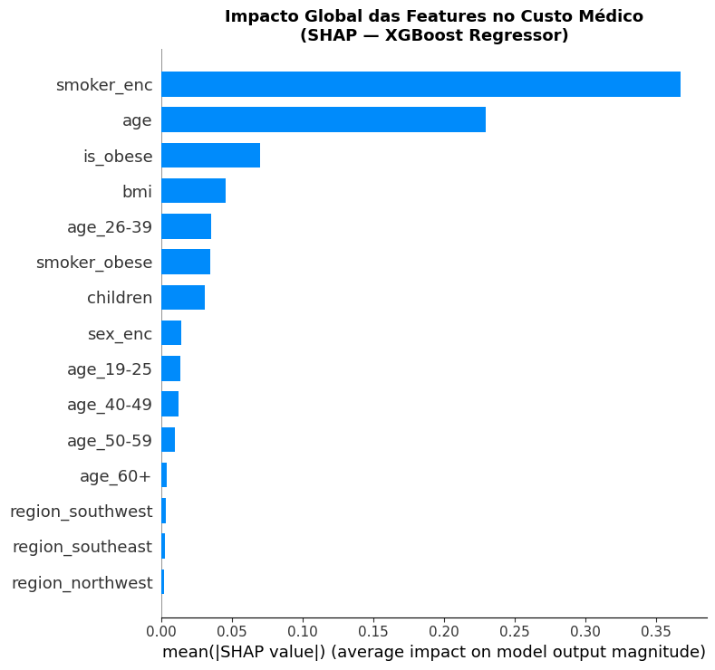

> 💡 **Ser fumante é 1.6x mais determinante que a idade para o custo médico.**

### Direção do Impacto de cada Feature

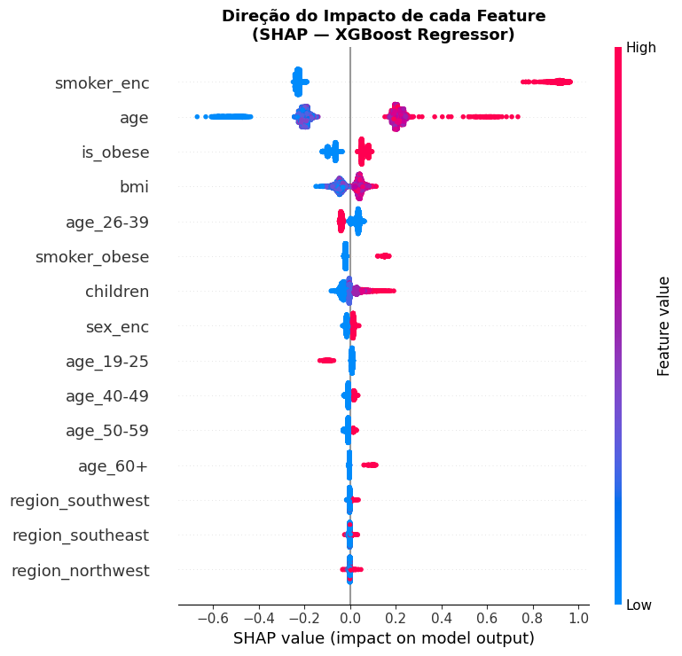

### Análise Individual por Perfil

O SHAP waterfall plot permite explicar a previsão de cada beneficiário individualmente:

| Perfil | Custo Previsto | Principal fator |
|---|---|---|
| 🔴 Fumante obeso | $42.885 | `smoker_enc` eleva muito |
| 🟢 Não fumante jovem | $6.407 | Sem fatores de risco |
| 🟡 Não fumante idoso | $26.115 | `age` eleva moderadamente |

**Perfil 1 — Fumante Obeso (Alto Custo)**

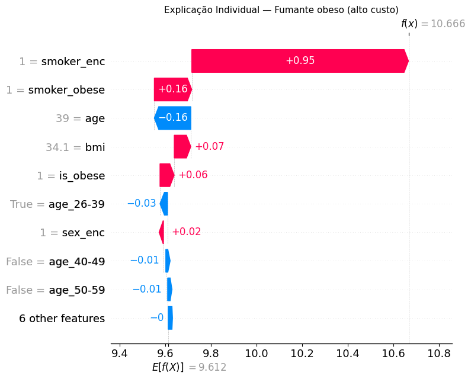

**Perfil 2 — Não Fumante Jovem (Baixo Custo)**

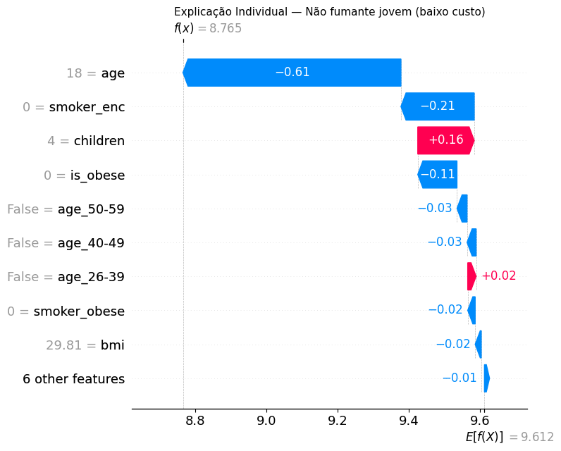

**Perfil 3 — Não Fumante Idoso (Médio Custo)**

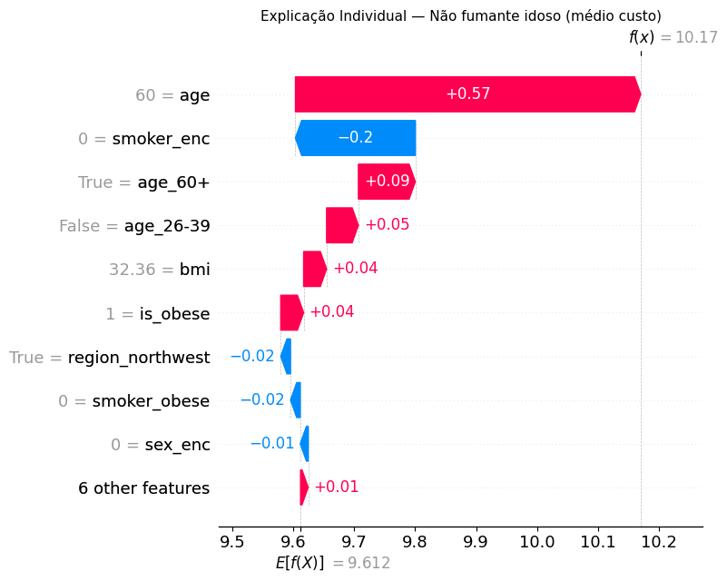

**Por que SHAP é essencial para seguradoras?**

- **Auditabilidade:** reguladores e auditores podem entender como cada decisão foi tomada
- **Transparência:** o beneficiário pode saber quais fatores influenciaram sua classificação
- **Ação:** gestores sabem exatamente onde intervir para reduzir risco (ex: programas antismoking)

---

## 🚀 App Streamlit

Interface visual de apoio à decisão para analistas de risco, atuários e gestores de saúde.

### Funcionalidades

- **Input:** perfil completo do beneficiário (idade, IMC, tabagismo, filhos, sexo, região)
- **Output 1:** Custo anual estimado em $
- **Output 2:** Classe de risco (Baixo / Médio / Alto)
- **Output 3:** Probabilidade de cada classe
- **Output 4:** Fatores de risco identificados no perfil
- **Output 5:** Gráfico SHAP explicando a decisão individualmente

### Validação com 3 Perfis Reais

| Perfil | Custo Previsto | Classe | Prob. Alto Custo |
|---|---|---|---|
| Fumante obeso, 52 anos | $63.587 | 🔴 Alto | 99.7% |
| Jovem saudável, 22 anos | $4.274 | 🟢 Baixo | 0.6% |
| Adulto não fumante, 45 anos | $13.785 | 🟡 Médio | 24.3% |

> A diferença de **$59.313/ano** entre o perfil de maior e menor risco demonstra o valor da ferramenta para precificação diferenciada de planos.

---

## 📊 Resultados Finais

### Resumo Executivo

| Modelo | Métrica | Resultado |
|---|---|---|
| XGBoost Regressor | MAE | $3.514 |
| XGBoost Regressor | R² | 88.3% |
| Random Forest Classifier | Acurácia | 72% |
| Random Forest Classifier | Falsos negativos críticos | **0** |
| SHAP — feature mais importante | smoker_enc | 0.368 |

### Impacto de Negócio

> Com esse modelo, uma operadora de saúde com 100.000 beneficiários pode:
>
> ✅ Identificar os ~11.000 pacientes de alto custo antes que os sinistros ocorram
>
> ✅ Provisionar corretamente os $637M em sinistros do grupo de alto custo
>
> ✅ Desenvolver programas de prevenção direcionados aos perfis críticos (fumantes obesos)
>
> ✅ Precificar planos de forma mais precisa com base no perfil de risco individual

---

### Limitações Atuais

- Dataset sintético baseado em dados americanos — padrões podem diferir no Brasil
- Modelo não substitui análise atuarial profissional

## ▶️ Como Rodar o Projeto

### Pré-requisitos
- Python 3.10+
- Git

### Instalação

```bash
# 1. Clonar o repositório
git clone https://github.com/ghs-mk/projeto-insurtech
cd projeto-insurtech

# 2. Criar ambiente virtual
python -m venv venv
venv\Scripts\activate       # Windows

# 3. Instalar dependências
pip install -r requirements.txt

# 4. Rodar o app
streamlit run app.py
```

### Rodar os Notebooks

Abra o VS Code na pasta do projeto e execute os notebooks na ordem:

```
01_eda.ipynb → 02_feature_engineering.ipynb → 03_model_regression.ipynb
→ 04_model_classification.ipynb → 05_explainability.ipynb
```

---

## 🛠️ Tecnologias

| Tecnologia | Uso |
|---|---|
| Python 3.14 | Linguagem principal |
| Pandas / NumPy | Manipulação de dados |
| Matplotlib / Seaborn | Visualizações |
| Scikit-learn | Modelagem e métricas |
| XGBoost | Modelo de regressão principal |
| SHAP | Explainability dos modelos |
| Streamlit | Interface do app |
| Jupyter Notebook | Desenvolvimento e análise |
| Pickle / JSON | Serialização dos modelos |


## Fontes

Aqui estão fontes relevantes que comprovem afirmações clínicas e técnicas de Data Science mencionadas no README, focando em aspectos gerais não derivados exclusivamente dos resultados do modelo.

### Afirmações Clínicas

- **Pacientes de alto custo:** "The top 5% of people with the highest health spending had an average of $72,918 in health expenditures annually; people with health spending in the top 1% had average spending of $150,467 per year." (implica múltiplos de até 10x ou mais em relação à média per capita). Fonte: https://www.healthsystemtracker.org/chart-collection/health-expenditures-vary-across-population

- **Pacientes de alto custo:** "Previous studies have estimated that 5% of patients account for half of all health care costs, while the top 1% of spenders account for over 27% of costs." Fonte: https://pmc.ncbi.nlm.nih.gov/articles/PMC10397786

- **Impacto do tabagismo em custos médicos:** "Health care costs for smokers at a given age are as much as 40 percent higher than those for nonsmokers." Fonte: https://pubmed.ncbi.nlm.nih.gov/9321534

- **Custos associados ao tabagismo:** "In 2018, cigarette smoking cost the United States more than $600 billion, including more than $240 billion in health care spending." Fonte: https://www.cdc.gov/nccdphp/priorities/tobacco-use.html

- **Limiar de obesidade (IMC > 30):** "Obesity 30 or greater." Fonte: https://www.cdc.gov/bmi/adult-calculator/bmi-categories.html

- **Custos associados à obesidade:** "Adults with obesity in the United States compared with those with normal weight experienced higher annual medical care costs by $2,505 or 100%." Fonte: https://pubmed.ncbi.nlm.nih.gov/33470881

- **Obesidade e custos de saúde:** "Obesity costs the US healthcare system almost $173 billion a year." Fonte: https://www.cdc.gov/obesity/php/about

### Técnicas de Data Science

- **Transformação logarítmica para dados assimétricos:** "The log transformation, a widely used method to address skewed data, is one of the most popular transformations used in biomedical and psychosocial research." Fonte: https://pmc.ncbi.nlm.nih.gov/articles/PMC4120293

- **Transformação log em regressão:** "Log transformation is the most popular one for right-skewed distributions in linear regression." Fonte: https://stats.stackexchange.com/questions/107610/what-is-the-reason-the-log-transformation-is-used-with-right-skewed-distribution

- **Feature engineering com termos de interação:** "Interaction features are new features created by combining two or more existing features." Fonte: https://apxml.com/courses/intro-feature-engineering/chapter-5-feature-creation/interaction-features

- **SHAP para explainability:** "SHAP (SHapley Additive exPlanations) is a game theoretic approach to explain the output of any machine learning model." Fonte: https://github.com/shap/shap

- **Introdução ao SHAP:** "SHAP values are a common way of getting a consistent and objective explanation of how each feature impacts the model's prediction." Fonte: https://www.datacamp.com/tutorial/introduction-to-shap-values-machine-learning-interpretability

---

## 👤 Autor

Gustavo Henrique da Silva

**Linkedin:***

www.linkedin.com/in/gustavo-henrique-silva-a6b826268

Desenvolvido como projeto de portfólio em Data Science com foco em IA aplicada à Saúde e Risco Financeiro.

*Projeto desenvolvido para fins educacionais e de portfólio. Não substitui análise atuarial profissional.*